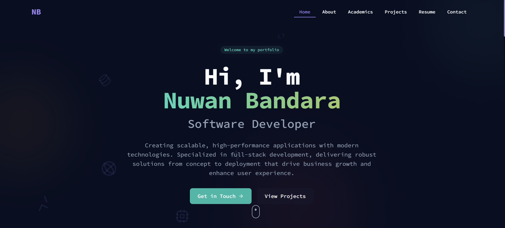

# Nuwan Bandara Portfolio

This is the personal portfolio website of Nuwan Bandara, showcasing skills, projects, and contact information.

## 🚀 Technologies Used

- **React** (with Vite)
- **TypeScript**
- **CSS3**
- **Devicon** (for technology icons)
- **Google Fonts** (Inter, JetBrains Mono)
- **GitHub Pages** (for hosting)

## 📸 Site Preview



<!-- For video demo, use: -->
<!-- [Watch Demo](demo.mp4) -->

## 🌐 Live Site

[https://itsnuwandev.github.io](https://itsnuwandev.github.io)

## 📁 How to Run Locally

```bash
git clone https://github.com/itsnuwandev/itsnuwandev.github.io.git
cd itsnuwandev.github.io
npm install
npm run dev
```

## 📝 License

This project is licensed under the MIT License.